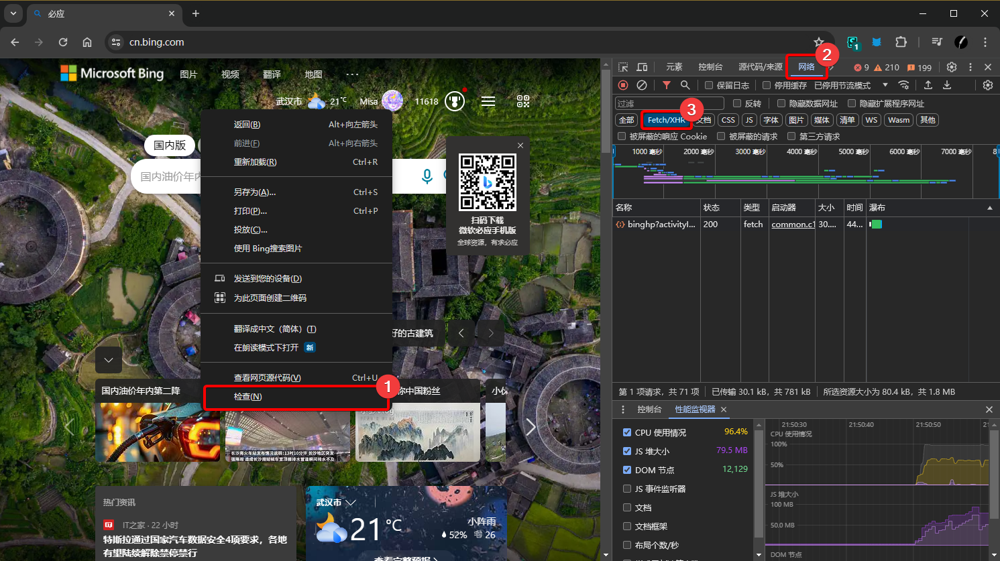
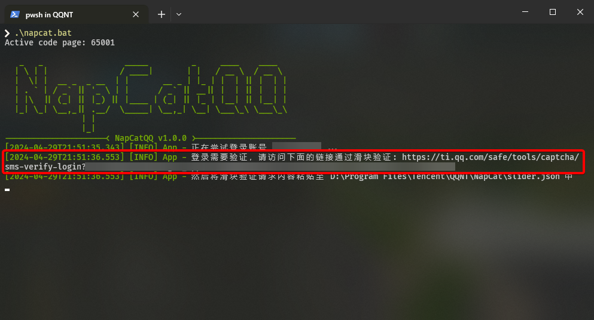
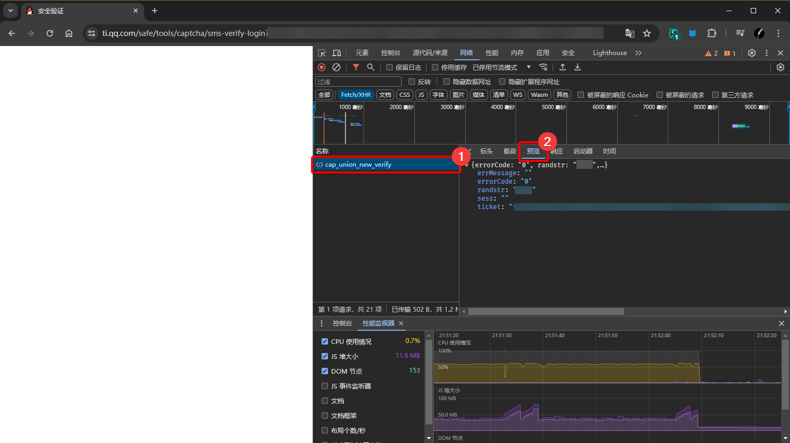
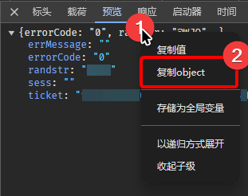

# 滑块验证帮助

本页将告诉您如何通过滑块验证。

## 准备工作

首先打开您的浏览器（本例将使用 Chrome 浏览器作为示例），创建一个新的标签页，然后按下键盘的 <kbd>F12</kbd> 或右键页面选择「检查」或「开发者模式」打开调试控制台。

接着，在弹出的调试控制台中，选择「网络（Network）」选项卡，然后选中「Fetch/XHR」过滤器即可。

## 通过滑块验证

回到 NapCatReforged，复制其提供的滑块验证链接，将其复制到刚才打开调试控制台的浏览器标签页中并打开。

然后正常进行滑块验证。验证完成后，在调试控制台的请求列表中选择名为 `cap_union_new_verify` 的请求，然后在弹出的页面中选择「预览」选项卡。

接着，我们右键该选项卡中内容的第一行，然后在弹出的菜单中选择「复制 object」将其内容复制到剪贴板中。

然后，将刚才复制的内容粘贴到 NapCatReforged 指定的文件中并保存，等待 NapCatReforged 进一步处理即可。