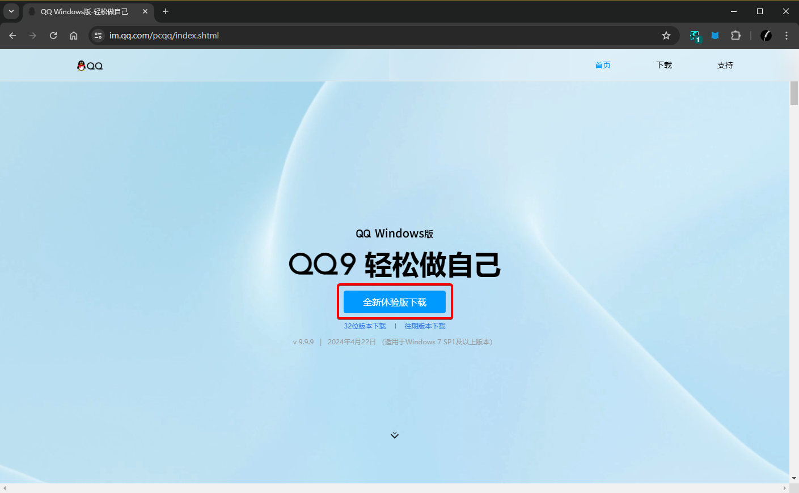
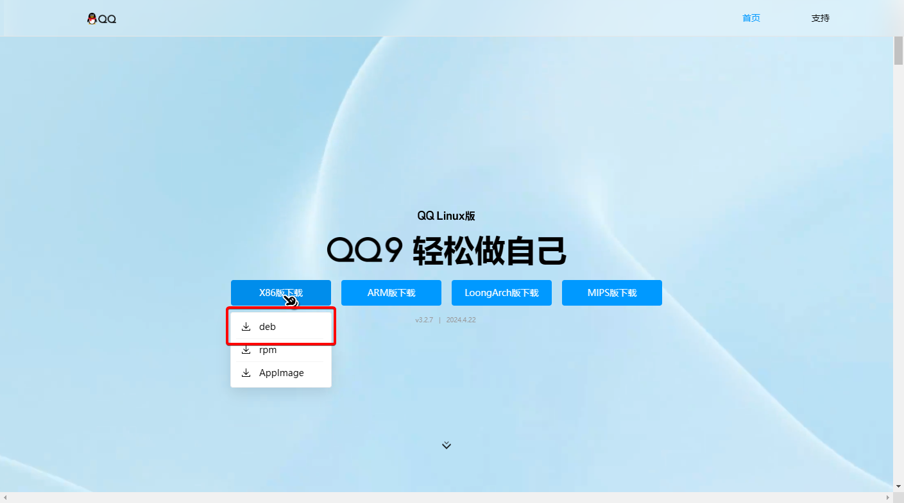

# 准备工作

由于 NapCatQQ 依赖官方的 QQNT 运行，所以首先需要在系统上安装 QQNT。

## Windows 用户

请从 [QQ 官网](https://im.qq.com/pcqq/index.shtml) 下载最新版的 **64 位** QQNT 并安装。

## Linux 用户

### 如果你正在使用 `Debian` 及其衍生发行版...

直接前往 [官网](https://im.qq.com/linuxqq/index.shtml) 下载对应系统架构的 `deb` 包然后使用 `dpkg` 命令安装即可。

### 如果你正在使用其他发行版...

如果你正在使用 Arch Linux，你可以考虑安装 [linuxqq](https://aur.archlinux.org/packages/linuxqq) 这个 AUR 包。

或者，你也可以选择前往 [官网](https://im.qq.com/linuxqq/index.shtml) 下载对应系统架构的 `deb` 包，然后将其中 `data/opt/QQ` 目录解压到一个你拥有读写权限的地方，并给予其中的 `qq` 二进制文件运行权限。

然后，安装 `libgbm1` 和 `libasound2` 这两个依赖包即可。

## macOS 用户

待补充...~~不会真的有人用 macOS 跑 Bot 吧？~~